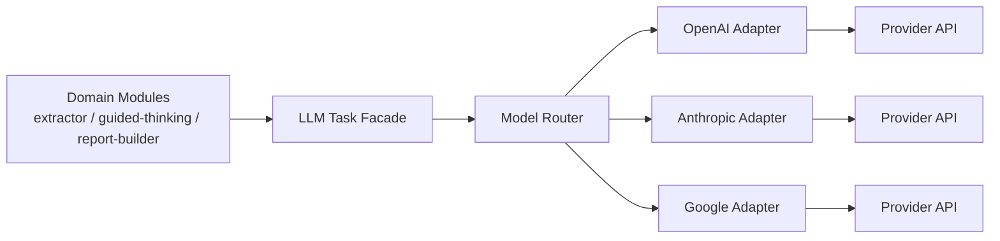

# LLM Adapter 技术设计

本文档定义 `8D Copilot` 后续接入真实 LLM 时的统一适配架构，目标是：

- 支持多模型
- 支持多供应商
- 让业务层按任务调用，而不是按厂商调用
- 支持成本控制、自动升级、失败回退
- 保证未来切换供应商时不改工作流和领域逻辑

当前定位：

- 这是技术设计文档
- 当前不包含代码实现
- 当前默认运行时仍是 `Next.js App Router + TypeScript`

---

## 1. 设计目标

本设计要解决的不是“怎么接一家模型”，而是“怎么让整个产品以后可以长期换模型、换供应商、做成本路由，而不把业务代码搞乱”。

具体目标：

1. `workflow-engine / extractor / guided-thinking / report-builder` 不直接依赖任一厂商 SDK
2. 所有 LLM 调用都按 `task type` 发起
3. 每类任务可以独立绑定：
   - 默认模型档位
   - 默认供应商
   - 备用供应商
   - 升级规则
4. 同一任务可以做 A/B 测试或按成本切换
5. 返回结果必须被统一规范化，不能把供应商差异漏到业务层

---

## 2. 非目标

当前阶段明确不做：

- 自建训练平台
- RAG / 向量数据库
- 多租户级别的模型权限系统
- 复杂队列与异步任务编排
- 供应商级计费系统
- 可视化 Prompt 管理后台

这些都可以后续再做，但不应该阻塞第一版适配器。

---

## 3. 备选方案

## 方案 A：业务模块直接调用供应商 SDK

例如：

- `extractor.ts` 里直接调 OpenAI
- `guided-thinking.ts` 里直接调 Anthropic
- `report-builder.ts` 里直接写模型名

优点：

- 上手最快

缺点：

- 强耦合
- 无法统一路由
- 无法统一 fallback
- 无法统一成本统计
- 后续切供应商会污染多个业务模块

结论：

- 不采用

## 方案 B：只做单一 Provider 封装

例如统一写一个 `llmClient.ts`，但里面仍默认绑定单一供应商。

优点：

- 比方案 A 好一点
- 能先收口部分重复逻辑

缺点：

- 仍然没有真正的多供应商能力
- 任务和模型没有解耦
- 容易演化成“单供应商 SDK 包装层”

结论：

- 可作为过渡，不建议作为正式架构

## 方案 C：Task Facade + Model Router + Provider Adapters

由业务层发起“任务调用”，路由层决定模型与供应商，adapter 层负责供应商协议转换。

优点：

- 任务与供应商彻底解耦
- 能支持多模型、多供应商
- 能支持 fallback、升级、A/B、成本路由
- 符合当前产品未来演进方向

缺点：

- 初始设计比方案 A/B 多一层抽象

结论：

- 采用方案 C

---

## 4. 推荐总体架构



核心原则：

- 业务模块只知道“任务”
- 路由层只知道“策略”
- Adapter 层才知道“厂商协议”

---

## 5. 分层职责

## 5.1 Domain Modules

包括：

- `extractor`
- `guided-thinking`
- `report-builder`
- 后续的 `analysis coach`

职责：

- 决定什么时候需要 LLM
- 组织任务输入
- 消费标准化输出

禁止：

- 直接引用任何厂商 SDK
- 直接写死模型名
- 直接写死供应商特定参数

## 5.2 LLM Task Facade

这是业务层唯一应该依赖的入口。

建议只暴露类似这样的接口：

- `runLlmTask(taskType, input, options)`

职责：

- 接收任务级调用
- 做输入检查
- 调用路由层
- 返回统一输出结构

它不负责：

- 决定具体厂商
- 直接请求第三方 API

## 5.3 Model Router

这是策略核心。

职责：

- 按任务选择默认模型档位
- 按任务选择默认供应商
- 决定是否自动升级
- 决定是否 fallback
- 记录路由决策元数据

它不负责：

- prompt 拼装细节
- 厂商协议适配

## 5.4 Provider Adapters

每家供应商都要实现统一接口。

示例：

- `OpenAIAdapter`
- `AnthropicAdapter`
- `GoogleAdapter`
- 未来国内聚合供应商 adapter

职责：

- 请求格式转换
- 参数映射
- 响应标准化
- 错误标准化
- token / latency / cost 元数据回传

---

## 6. 任务模型

当前建议的任务枚举：

- `extract`
- `classify`
- `rewrite`
- `guided_question`
- `draft_stage`
- `root_cause_deep_analysis`
- `final_polish`

这些任务比“模型名”更稳定，应该成为架构里的一级概念。

---

## 7. 每类任务的默认定位

当前最新默认模型决策：

- 第一档默认：`qwen3.5-plus`
- 第二档默认：`qwen3.5-plus`
- 第三档默认：`deepseek-chat`
- 复杂升级：`deepseek-reasoner`

## 7.1 `extract`

用途：

- 所有用户输入的第一轮广覆盖抽取

输入：

- 原始用户文本
- 当前案件上下文摘要
- 当前阶段

输出：

- 候选事实
- 候选结构化字段
- 事实/假设/风险/缺口分类
- 置信度

默认模型：

- `qwen3.5-plus`

## 7.2 `guided_question`

用途：

- 生成当前最该追问的一两个问题

输出重点：

- 主问题
- 为什么问
- 想填补哪个缺口

默认模型：

- `qwen3.5-plus`

## 7.3 `draft_stage`

用途：

- 生成 D2 / D3 / D4 / D5 等阶段工作稿

输出重点：

- 章节草稿
- 当前结论
- 待验证点

默认模型：

- `qwen3.5-plus`

## 7.4 `root_cause_deep_analysis`

用途：

- 深度根因推理

输出重点：

- 发生原因
- 逃逸原因
- 系统原因
- 当前证据支撑度
- 下一步验证动作

默认模型：

- `deepseek-chat`

复杂升级模型：

- `deepseek-reasoner`

## 7.5 `final_polish`

用途：

- 对客 Final 报告润色

输出重点：

- 风格统一
- 表达正式
- 不改变事实边界

默认模型：

- `deepseek-chat`

复杂升级模型：

- `deepseek-reasoner`

---

## 8. 标准接口建议

## 8.1 Task Facade 接口

建议接口概念如下：

```ts
runLlmTask(taskType, input, options) => TaskResult
```

其中：

- `taskType`：任务类型
- `input`：任务输入
- `options`：覆盖项，例如强制供应商、强制档位、禁用 fallback
- `TaskResult`：统一结果

## 8.2 TaskResult 统一结构

建议统一返回：

- `output`
- `provider`
- `model`
- `tier`
- `latencyMs`
- `promptTokens`
- `completionTokens`
- `estimatedCost`
- `fallbackUsed`
- `attempts`
- `warnings`
- `rawResponseRef`

这样未来无论接哪家模型，业务层拿到的结构都一致。

---

## 9. Provider Adapter 接口建议

每个 Provider Adapter 至少要实现：

- `isAvailable()`
- `invoke(request)`
- `normalizeError(error)`
- `estimateCost(usage)`

### `invoke(request)` 的职责

- 接收标准化请求
- 转换成供应商请求格式
- 调用供应商 API
- 解析供应商响应
- 输出统一响应结构

### 标准化请求建议字段

- `taskType`
- `systemPrompt`
- `userPrompt`
- `jsonSchema`
- `temperature`
- `maxTokens`
- `timeoutMs`
- `metadata`

注意：

- 供应商特有参数不能泄漏到业务层
- 如确实需要，也应先进入 adapter 内部映射

---

## 10. 路由策略

## 10.1 默认路由表

建议由一个集中式配置维护：

- `extract -> qwen3.5-plus`
- `guided_question -> qwen3.5-plus`
- `draft_stage -> qwen3.5-plus`
- `root_cause_deep_analysis -> deepseek-chat`
- `final_polish -> deepseek-chat`

每条配置至少包括：

- 主供应商
- 主模型
- 备用供应商列表
- 是否允许自动升级

当前建议的升级规则：

- `root_cause_deep_analysis`
  - 默认：`deepseek-chat`
  - 当假设路径超过 2 条、涉及发生原因与逃逸原因并存、或用户明确要求深度分析时，升级到 `deepseek-reasoner`
- `final_polish`
  - 默认：`deepseek-chat`
  - 当输出对象是对客 Final、风险等级高、或需要更稳健的因果与边界表达时，升级到 `deepseek-reasoner`
- 是否允许降级

## 10.2 升级策略

可以自动升级的条件：

- 输出结构不完整
- 明显无法通过 schema 校验
- 多轮冲突高
- 用户明确要求深度分析
- 当前任务是高风险 Final

## 10.3 Fallback 策略

建议顺序：

1. 同供应商重试一次
2. 同档位切备用供应商
3. 如果任务允许，再切到下一档位
4. 如果任务不允许降级，则返回明确错误

不同任务的 fallback 要不同：

- `extract` 可以更积极 fallback
- `root_cause_deep_analysis` 不能随意降级

---

## 11. 结果校验与安全收口

因为本产品面向质量与异常处理，LLM 输出不能直接写进正式结论。

建议所有任务都经过收口层。

### 对 `extract`

需要做：

- 字段格式校验
- 归一化
- 去重
- 置信度过滤

### 对 `draft_stage`

需要做：

- 标记哪些内容来自已知事实
- 标记哪些内容属于假设
- 避免把未验证假设写成确认结论

### 对 `final_polish`

需要做：

- 禁止新增事实
- 禁止改写既有结论边界
- 只能改善表达，不改变证据状态

---

## 12. Prompt 与任务边界

Prompt 也不应该散落在各业务模块里。

建议：

- 每个任务维护自己的 prompt builder
- prompt builder 产出标准化请求
- adapter 不负责业务 prompt 设计

推荐边界：

- 业务模块：决定要做什么任务
- task module：决定任务输入结构与 prompt
- adapter：决定怎么发给供应商

---

## 13. 配置方式

当前推荐：

- 配置文件 + 环境变量结合

建议分两类配置：

### 静态配置

例如：

- 任务到模型档位的映射
- 默认供应商优先级
- fallback 允许策略

### 环境变量

例如：

- API Key
- Base URL
- 供应商启停
- 超时参数

这样可以避免把敏感信息写进代码。

---

## 14. 监控与成本记录

当前阶段不需要做重型 observability，但必须保留最小成本记录能力。

建议记录：

- `taskType`
- `provider`
- `model`
- `tier`
- `latencyMs`
- `promptTokens`
- `completionTokens`
- `estimatedCost`
- `success / failure`
- `fallbackUsed`

原因：

- 后续才能知道哪个任务最贵
- 才能知道是否该换模型
- 才能做个人付费商业化时的成本测算

---

## 15. 推荐目录形态

如果后续在当前仓库实现，建议目录大致如下：

```text
lib/
  llm/
    index.ts
    types.ts
    tasks/
      extract.ts
      guided-question.ts
      draft-stage.ts
      final-polish.ts
      root-cause-deep-analysis.ts
    router/
      model-router.ts
      routing-config.ts
    providers/
      base.ts
      openai.ts
      anthropic.ts
      google.ts
    telemetry/
      usage-recorder.ts
```

这只是推荐形态，不是必须逐字照搬。

---

## 16. 分阶段落地建议

建议分三步做。

### 第一步：最小适配器骨架

先实现：

- `runLlmTask`
- `ModelRouter`
- 一个主供应商 adapter
- 一个备用供应商 adapter
- `extract / guided_question / draft_stage` 三类任务

### 第二步：深度分析任务

补：

- `root_cause_deep_analysis`
- `final_polish`
- 自动升级策略

### 第三步：运营级能力

补：

- A/B 路由
- 成本报表
- 人工强制路由
- 更完整的失败回退

---

## 17. 当前结论

这套产品后续一定会碰到：

- 模型效果差异
- 供应商可用性差异
- 成本压力
- 国内外供应商切换

所以现在就应该把 LLM 接入做成：

`任务接口稳定，供应商实现可替换`

这是后续多模型、多供应商、多成本层运行的前提，也是避免业务层被模型 SDK 污染的关键。
